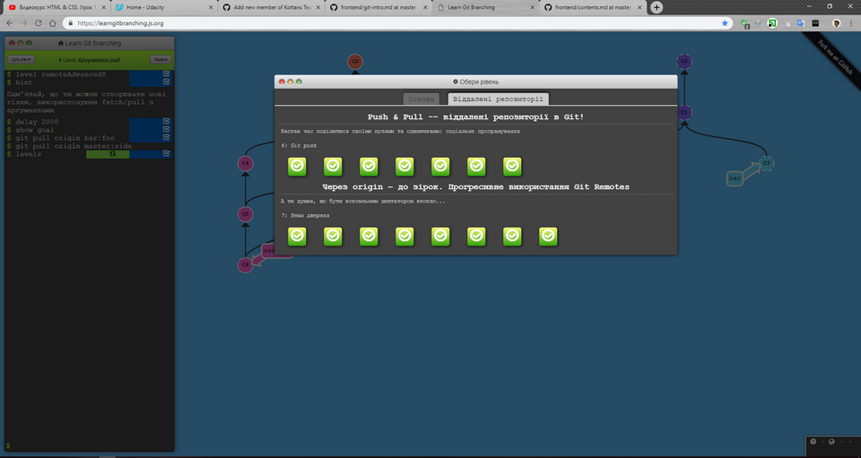

# My impressions of the Front-End course from Kottans.

### Thanks to Kottans for this exellent course! So, this is my progress history:

0. Stage 0.1:

	- [x] Finish the course [How to use Git and GitHub](https://www.udacity.com/course/how-to-use-git-and-github--ud775).
	
	- [x] Finish [try.github.io](https://try.github.io/levels/1/challenges/1).
	
	
	- [x] Create [repository](https://github.com/DJStar77/kottans-frontend) named `kottans-frontend`.
	- [x] Create [`README.md`](https://github.com/DJStar77/kottans-frontend/blob/master/README.md) for the repository.
	- [x] Describe your impressions about learned materials.
	- [x] Send a [pull-request](https://github.com/kottans/mock-repo/pull/219) to [Kottans/mock-repo](https://github.com/Kottans/mock-repo) proposing a change.
	- [x] Study Extra Materials below to improve your skills.

0. Stage 0.2: **Linux, Command Line, HTTP Tools**
	## Linux CLI, and HTTP
	- [x] [Learn the Command Line](https://www.codecademy.com/learn/learn-the-command-line)
		
	- [x] [HTTP: The Protocol Every Web Developer Must Know - Part 1](https://code.tutsplus.com/tutorials/http-the-protocol-every-web-developer-must-know-part-1--net-31177)
	- [x] [HTTP: The Protocol Every Web Developer Must Know - Part 2](https://code.tutsplus.com/tutorials/http-the-protocol-every-web-developer-must-know-part-2--net-31155)

## Git Collaboration
0. Stage 0.3: **Git for Team Collaboration**

	- [x] [What is Version Control](https://classroom.udacity.com/courses/ud123/)
	
	- [x] [GitHub & Collaboration](https://classroom.udacity.com/courses/ud456)
	

0. Stage 0.4: **Intro to HTML and CSS**

	- [ ] [Intro to HTML & CSS (Eng)](https://www.udacity.com/course/intro-to-html-and-css--ud304)
	- [ ] [HTML Academy: first two sections, "Basics of HTML" & "Basics of CSS" — free exercises only, you don't have to do paid ones (Rus) [~10 hours]](https://htmlacademy.ru/)

0. Stage 0.5: **Responsive Web Design**
	- [ ] [Responsive Web Design Fundamentals](https://www.udacity.com/course/responsive-web-design-fundamentals--ud893)
	- [ ] [Flexbox Froggy](http://flexboxfroggy.com/)

0. Stage 0.6: **JavaScript Basics**
	- [ ] [Intro to JS](https://www.udacity.com/course/intro-to-javascript--ud803)
	- [ ] [freecodecamp Algorithm Scripting Challenges](https://learn.freecodecamp.org/javascript-algorithms-and-data-structures/intermediate-algorithm-scripting)

0. Stage 0.7: **Document Object Model**
	- [ ] [JavaScript and the DOM](https://classroom.udacity.com/courses/ud117) (4 lessons, estimated completion time 8 hrs)
	- [ ] [freecodecamp Algorithm Scripting Challenges](https://learn.freecodecamp.org/javascript-algorithms-and-data-structures/intermediate-algorithm-scripting) finish the second half of the course (10 lessons) and save a screenshot.
	- [ ] [Practical task](https://github.com/kottans/frontend/blob/master/tasks/js-dom.md#then)

0. Stage 0.8: **Building a Tiny JS World**
	- [ ] Build a tiny JS world model following the instructions [here](https://github.com/OleksiyRudenko/a-tiny-JS-world).

0. Stage 0.9: **Object-Oriented JavaScript**
	- [ ] [Object Oriented JS](https://classroom.udacity.com/courses/ud015)
	- [ ] [codewars](https://www.codewars.com/) - register, join Kottans clan and reach 7 kyu.

0. Stage 0.10: [**OOP exercise**](https://github.com/kottans/frontend/blob/master/tasks/js-post-oop.md)
	- [ ] Improve your tiny JS world model
	- [ ] code review
	- [ ] Post a message in [course channel](https://t.me/joinchat/CX8EF1JmLm9IM6J6oy2U7Q)

0. Stage 0.11: **Offline Web Applications**
	- [ ] [Offline Web Applications](https://www.udacity.com/course/offline-web-applications--ud899)

0. Stage 0.12: **Memory – Pair Game**
	- [ ] [Memory – Pair Game](https://github.com/kottans/frontend/blob/master/tasks/memory-pair-game.md)

0. Stage 0.13: **Website Performance Optimization**
	- [ ] [Website Performance Optimization](https://github.com/kottans/frontend/blob/master/tasks/app-design-performance.md)

0. Stage 0.14: **Friends App**
	- [ ] [Friends App](https://github.com/kottans/frontend/blob/master/tasks/friends-app.md)